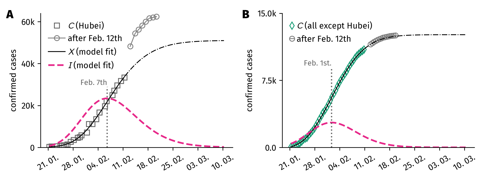

# COVID-19 case number growth

The growth of case numbers concerning the recent COVID-19 outbreak
in provinces of Mainland China can be modeled by a new SIR containment model.
This is a complimentary repository that contains the data and the analysis discussed in the paper [B. F. Maier and D. Brockmann, "Effective containment explains sub-exponential growth in confirmed cases of recent COVID-19 outbreak in Mainland China", 2020]().

## Data 

The json-file `data/all_confirmed_cases_with_population.json` contains case number data
of the currently affected provinces in China as well as population size.

The time series count the aggregate number of people whose infection was laboratory-confirmed.
It was gathered by the [Johns Hopkins University Center for Systems Science and Engineering](https://github.com/CSSEGISandData/COVID-19).

For the data contained in `mainland_china`, all province data except the one from Hubei
was aggregated by means of interpolation.

Since beginning at Feb 12, the case data includes symptomatic cases without lab-confirmation, as well,
we only consider data from before Feb 12 6am.

## Prerequisites

Written and tested for Python 3.7

### Requirements

```bash
pip install requirements.txt
```
These are the requirements:

```
simplejson==3.16.0
numpy==1.17.2
scipy==1.3.1
bfmplot==0.0.7
lmfit==0.9.12
tabulate==0.8.2
matplotlib==3.0.2
tqdm==4.28.1
```

## Examples

Reproduce plots

```
python model_large_hubei_and_mainland_china.py fit_parameters/hubei_china.p
python model_fit_confirmed_cases_500.py fit_parameters/confirmed_cases_500.p
```




In case you want new fits, do

```
model_large_hubei_and_mainland_china.py
python model_fit_confirmed_cases_500.py
```

The fit parameters are saved in `fit_parameters/confirmed_cases_500.p`

Works similarly for the other analysis scripts.
